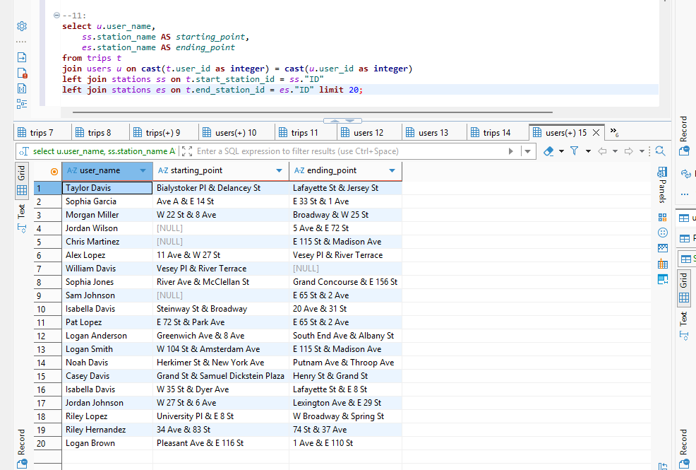
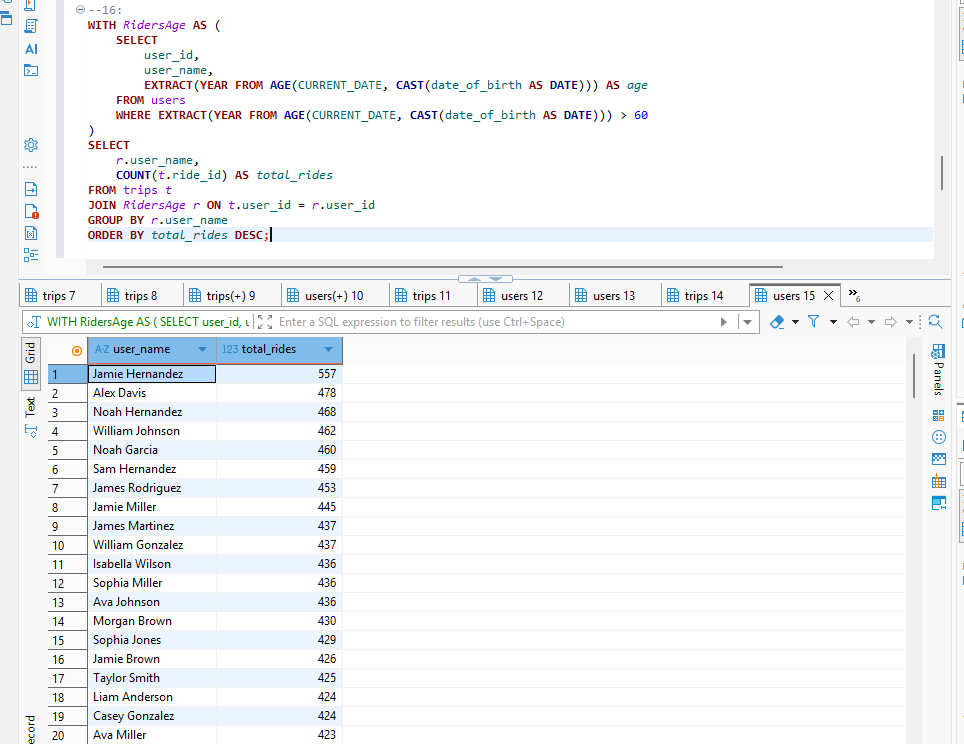
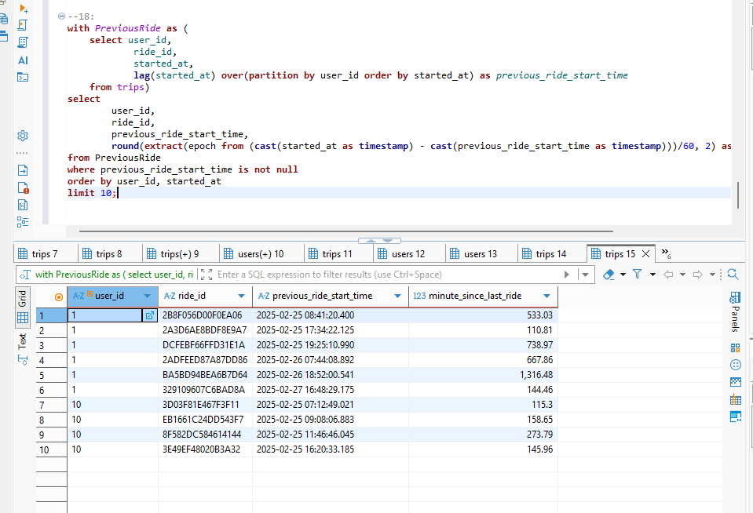

# 🚲 NYC Citi Bike — PostgreSQL Data Analysis

> **A relational SQL analysis exploring rider behavior, station activity, demographic patterns, and ride frequency using PostgreSQL joins, CTEs, aggregations, and window functions.**

<p align="center">
  
</p>

---

## 📌 Project Overview

A bike-sharing trip may look like a simple event:

```text
Rider → Picks Up Bike → Starts Trip → Ends Trip → Returns Bike
```

But answering analytical questions about that trip requires connecting multiple pieces of relational data.

This project analyzes a sample dataset based on the **NYC Citi Bike system** using PostgreSQL.

The database contains three related entities:

```text
USERS
  │
  │ user_id
  ▼
TRIPS
  │
  ├──── start_station_id ────► STATIONS
  │
  └──── end_station_id ──────► STATIONS
```

The complete project contains **18 SQL analysis questions** covering data exploration, cleaning, joins, aggregations, CTEs, and window functions.

The objective was not simply to practice SQL syntax, but to understand how relational data can be combined to answer questions about:

- 👤 Rider behavior
- 🚉 Station usage
- 👥 Demographic riding patterns
- ⏱️ Time between rides
- 🔗 Relationships across multiple tables

---

# 🎯 Project Objectives

This project was designed to strengthen my ability to:

- explore an unfamiliar relational dataset,
- identify relationships between tables,
- clean and convert inconsistent data types,
- use multiple joins within the same query,
- aggregate rider activity,
- structure multi-step analysis with CTEs,
- use window functions for sequential behavior,
- calculate time differences,
- and translate analytical questions into SQL.

The general workflow is:

```text
Business / Analytical Question
            ↓
Identify Required Tables
            ↓
Understand Relationships
            ↓
Prepare / Convert Data
            ↓
Build SQL Logic
            ↓
Inspect Results
            ↓
Interpret the Output
```

---

# 🗄️ Database Architecture

The relational database consists of three primary tables:

```text
┌───────────────┐
│     USERS     │
│───────────────│
│ user_id       │
│ user_name     │
│ date_of_birth │
│ ...           │
└───────┬───────┘
        │
        │ user_id
        ▼
┌─────────────────────┐
│        TRIPS        │
│─────────────────────│
│ ride_id             │
│ user_id             │
│ start_station_id    │
│ end_station_id      │
│ started_at          │
│ ...                 │
└─────┬─────────┬─────┘
      │         │
      │         │
 start_station  end_station
      │         │
      ▼         ▼
┌─────────────────────┐
│      STATIONS       │
│─────────────────────│
│ ID                  │
│ station_name        │
│ ...                 │
└─────────────────────┘
```

A particularly interesting part of this model is that the `trips` table references the **same stations table twice**:

```text
                    ┌──► Start Station
                    │
TRIP ────────────────┤
                    │
                    └──► End Station
```

That relationship becomes important when reconstructing a complete rider journey.

---

# 🧹 Data Preparation

One challenge in the dataset is inconsistent data types between related fields.

For example, the `user_id` values used in joins require type conversion in parts of the analysis.

A representative join is:

```sql
JOIN users u
    ON CAST(t.user_id AS INTEGER) = CAST(u.user_id AS INTEGER)
```

This allows the related values to be compared using compatible data types.

However, in a production database, repeatedly casting join keys would not be ideal.

A stronger long-term solution would be:

```text
Source Data
    ↓
Standardize Data Types
    ↓
Consistent PK / FK Types
    ↓
Direct Join
```

This would make the schema more predictable and reduce the need for query-time conversion.

---

# 🔍 Featured Analysis

The complete SQL script contains **18 analysis questions**.

Below are three examples that demonstrate some of the most important relational and analytical techniques used in the project.

---

# 1. 🗺️ Mapping the Full Rider Journey

## Objective

Combine rider and station information to show:

```text
WHO rode?
    +
WHERE did the trip start?
    +
WHERE did the trip end?
```

The desired output is conceptually:

```text
Rider | Starting Station | Ending Station
```

---

## The Relational Challenge

A single trip contains two references to the same table:

```text
trips.start_station_id
        ↓
     stations

trips.end_station_id
        ↓
     stations
```

Therefore, the `stations` table needs to participate in the query twice.

The solution is to give each instance a different alias:

```text
stations AS ss
     ↓
Start Station

stations AS es
     ↓
End Station
```

---

## SQL

```sql
SELECT
    u.user_name,
    ss.station_name AS starting_point,
    es.station_name AS ending_point
FROM trips t
JOIN users u
    ON CAST(t.user_id AS INTEGER) = CAST(u.user_id AS INTEGER)
LEFT JOIN stations ss
    ON t.start_station_id = ss."ID"
LEFT JOIN stations es
    ON t.end_station_id = es."ID"
LIMIT 20;
```

---

## Why Join `stations` Twice?

Because these columns represent two different roles:

```text
              TRIP
               │
       ┌───────┴───────┐
       ▼               ▼
START STATION       END STATION
       │               │
       └───────┬───────┘
               ▼
          STATIONS TABLE
```

Even though both values come from the same physical table, they represent different meanings within the trip.

Aliases make that distinction explicit.

---

## Why `LEFT JOIN`?

The rider relationship uses:

```sql
JOIN users u
```

while station information uses:

```sql
LEFT JOIN stations
```

The `LEFT JOIN` preserves the trip even if a matching station record is unavailable.

Conceptually:

```text
Trip Exists
    │
    ├── Station Match Found
    │        ↓
    │    Show Station
    │
    └── No Station Match
             ↓
         Keep Trip
         Station = NULL
```

This can be useful when investigating incomplete or unmatched station references because the trip itself remains visible instead of disappearing from the result.

---

## Result

<p align="center">
  
</p>

---

## Key SQL Concepts

```text
✓ Multi-table JOIN
✓ LEFT JOIN
✓ Table aliases
✓ Joining the same table twice
✓ Data-type conversion
✓ Relational reasoning
```

---

# 2. 👴 Senior Rider Activity — CTE + Aggregation

## Objective

Calculate the total number of rides taken by riders older than 60 and rank them by ride count.

Conceptually:

```text
Users
  ↓
Calculate Age
  ↓
Keep Age > 60
  ↓
Connect to Trips
  ↓
Count Rides per Rider
  ↓
Order by Ride Count
```

---

## SQL

```sql
WITH RidersAge AS (
    SELECT
        user_id,
        user_name,
        EXTRACT(
            YEAR FROM AGE(
                CURRENT_DATE,
                CAST(date_of_birth AS DATE)
            )
        ) AS age
    FROM users
    WHERE EXTRACT(
        YEAR FROM AGE(
            CURRENT_DATE,
            CAST(date_of_birth AS DATE)
        )
    ) > 60
)

SELECT
    r.user_name,
    COUNT(t.ride_id) AS total_rides
FROM trips t
JOIN RidersAge r
    ON t.user_id = r.user_id
GROUP BY r.user_name
ORDER BY total_rides DESC;
```

---

## Why Use a CTE?

The CTE separates the problem into two logical stages.

### Stage 1 — Identify Senior Riders

```text
USERS
  ↓
Calculate Age
  ↓
Age > 60
  ↓
RidersAge
```

### Stage 2 — Analyze Their Trip Activity

```text
RidersAge
    +
TRIPS
    ↓
Count Rides
    ↓
Group by Rider
```

This makes the query easier to understand because each stage has a clear responsibility.

Instead of thinking about:

```text
Age Calculation
+ Filtering
+ Joining
+ Counting
+ Grouping
+ Ordering
```

all at once, the logic becomes:

```text
First:
"Who are the senior riders?"

Then:
"How many rides did each of them take?"
```

---

## A Note on Performance

It may be tempting to say that filtering users inside the CTE automatically makes the query faster.

That conclusion should not be made without measuring it.

PostgreSQL's query planner can optimize and reorganize query execution, and CTE behavior can also depend on PostgreSQL version and query structure.

Therefore, the defensible conclusion here is:

> **The CTE makes the analytical logic clearer and defines the senior-rider population before the final ride aggregation.**

To determine whether this structure is actually faster than an alternative query, I would compare execution plans using:

```sql
EXPLAIN ANALYZE
```

For example:

```text
Query A
CTE Version
    │
    ├────► EXPLAIN ANALYZE
    │
    ▼
Execution Plan A


Query B
Alternative Version
    │
    ├────► EXPLAIN ANALYZE
    │
    ▼
Execution Plan B


Compare
    ↓
Execution Time
Rows Processed
Join Strategy
Scan Strategy
```

This separates:

```text
Readable Query Structure
          ≠
Proven Performance Improvement
```

---

## Result

<p align="center">
  
</p>

---

## Key SQL Concepts

```text
✓ Common Table Expression (CTE)
✓ Date conversion
✓ AGE()
✓ EXTRACT()
✓ Filtering
✓ COUNT()
✓ GROUP BY
✓ ORDER BY
```

---

# 3. ⏱️ Time Between Rides — Window Functions

## Objective

Calculate how many minutes passed between a rider's current ride and their previous ride.

This is a sequential problem.

For each user, we need to know:

```text
Current Ride
     ↓
Previous Ride
     ↓
Time Difference
```

A normal aggregation such as:

```sql
GROUP BY
```

is not enough because we need to compare one row with another row while preserving individual ride records.

This is where a window function becomes useful.

---

## SQL

```sql
WITH PreviousRide AS (
    SELECT
        user_id,
        ride_id,
        started_at,

        LAG(started_at) OVER (
            PARTITION BY user_id
            ORDER BY started_at
        ) AS previous_ride_start_time

    FROM trips
)

SELECT
    user_id,
    ride_id,
    previous_ride_start_time,

    ROUND(
        EXTRACT(
            EPOCH FROM (
                CAST(started_at AS TIMESTAMP)
                -
                CAST(previous_ride_start_time AS TIMESTAMP)
            )
        ) / 60,
        2
    ) AS minute_since_last_ride

FROM PreviousRide
WHERE previous_ride_start_time IS NOT NULL
ORDER BY user_id, started_at
LIMIT 10;
```

---

# 🪟 Understanding `LAG()`

The key expression is:

```sql
LAG(started_at) OVER (
    PARTITION BY user_id
    ORDER BY started_at
)
```

Let's break it down.

---

## `PARTITION BY user_id`

This creates a separate ride history for each rider.

Without it:

```text
All Riders
    ↓
One Combined Timeline ❌
```

With it:

```text
User A
Ride 1 → Ride 2 → Ride 3

User B
Ride 1 → Ride 2

User C
Ride 1 → Ride 2 → Ride 3
```

The previous ride for User B therefore cannot accidentally come from User A.

---

## `ORDER BY started_at`

Within each user, rides are arranged chronologically:

```text
10:00
  ↓
13:30
  ↓
18:45
```

That gives `LAG()` a meaningful sequence.

---

## `LAG(started_at)`

`LAG()` retrieves the value from the previous row in that sequence.

Example:

```text
Ride     Start       Previous Start
────────────────────────────────────
1        10:00       NULL
2        13:30       10:00
3        18:45       13:30
```

The first ride has no previous ride, so:

```text
Previous Start = NULL
```

---

# 🧮 Calculating the Time Difference

Once both timestamps are available:

```text
Current Ride Start
        -
Previous Ride Start
        ↓
     Interval
```

PostgreSQL can calculate the difference between them.

Then:

```sql
EXTRACT(EPOCH FROM interval)
```

converts that interval into seconds.

Dividing by:

```text
60
```

converts:

```text
Seconds → Minutes
```

Finally:

```sql
ROUND(..., 2)
```

makes the output easier to read.

---

## Result

<p align="center">
  
</p>

---

## Key SQL Concepts

```text
✓ LAG()
✓ Window functions
✓ PARTITION BY
✓ ORDER BY inside a window
✓ CTEs
✓ Timestamp conversion
✓ Date arithmetic
✓ EXTRACT(EPOCH)
```

---

# 🧠 Why Window Functions Matter

Consider:

```text
User A

Ride 1 ──────► Ride 2 ─────────────► Ride 3
 10:00          13:30                 18:45
```

The analytical question is not:

> “How many rides did User A take?”

That could be answered with:

```sql
COUNT(*)
```

Instead, we want:

> “How much time passed between each ride and the ride immediately before it?”

That requires understanding **sequence**.

```text
Aggregation
    ↓
Summarizes Groups


Window Function
    ↓
Analyzes Relationships
Across Rows
```

That is why `LAG()` is the appropriate tool for this problem.

---

# 🔄 SQL Problem-Solving Approach

Across the 18 questions, I used a general workflow:

```text
1. Understand the Question
            ↓
2. Determine the Required Output
            ↓
3. Identify Relevant Tables
            ↓
4. Identify Join Keys
            ↓
5. Check Data Types
            ↓
6. Build the Query Incrementally
            ↓
7. Apply Aggregation / CTE / Window Logic
            ↓
8. Inspect the Result
            ↓
9. Validate the Interpretation
```

The goal is not simply:

```text
Write SQL → Query Runs → Done
```

but:

```text
Question
   ↓
Relational Logic
   ↓
SQL
   ↓
Validation
   ↓
Meaningful Result
```

---

# 🧪 Validation Thinking

A query returning rows does not automatically mean the analysis is correct.

For example, after joining tables I may want to ask:

```text
Did the row count unexpectedly increase?

Are IDs duplicated?

Did INNER JOIN remove records?

Did LEFT JOIN introduce NULLs?

Did a CAST change the expected matching behavior?

Does one row still represent what I think it represents?
```

Useful SQL checks can include:

```sql
SELECT COUNT(*)
FROM trips;
```

and:

```sql
SELECT
    user_id,
    COUNT(*)
FROM trips
GROUP BY user_id
ORDER BY COUNT(*) DESC;
```

For join investigations, comparing counts before and after a join can help identify unexpected behavior.

---

# ⚠️ Data-Type Consistency

The need to use:

```sql
CAST(...)
```

during joins reveals an important data-quality issue.

Related PK/FK-style fields should ideally use compatible types.

Instead of relying on:

```text
TEXT user_id
      ↓
CAST during JOIN
      ↓
INTEGER user_id
```

a cleaner design would standardize those types during ingestion or schema creation:

```text
Raw Data
   ↓
Validation
   ↓
Type Standardization
   ↓
Database
   ↓
Consistent Join Keys
```

This is an important lesson because data analysis is often affected by upstream data quality.

---

# ⚠️ Project Scope & Limitations

This repository is a **portfolio-scale SQL analysis using a sample Citi Bike-style dataset**.

The analysis demonstrates relational SQL techniques and analytical reasoning, but it should not be interpreted as a production analysis of the complete NYC Citi Bike system.

Important limitations include:

- The project uses a sample dataset.
- Query results apply to the supplied project data.
- Data-type inconsistencies require casting in parts of the analysis.
- Query performance has not been benchmarked.
- No performance improvement should be assumed without execution-plan comparison.
- The project focuses primarily on SQL analysis rather than production data engineering.

These limitations define the scope of the project and identify useful areas for further development.

---

# 🚀 How I Would Extend This Project

## 1. Standardize the Schema

Align related key data types so joins do not require repeated casting.

```text
Raw Source
    ↓
Schema Validation
    ↓
Correct Data Types
    ↓
Consistent Relationships
```

---

## 2. Add Data-Quality Checks

Examples:

```text
Missing User IDs
Missing Station IDs
Duplicate Ride IDs
End Time < Start Time
Unknown Stations
Invalid Dates
Impossible Trip Durations
```

---

## 3. Benchmark Query Performance

Instead of describing a query as optimized based only on its structure:

```sql
EXPLAIN ANALYZE
```

could be used to compare alternatives.

Metrics could include:

```text
Execution Time
Rows Scanned
Join Strategy
Scan Type
Planning Time
```

This would allow performance claims to be supported by actual evidence.

---

## 4. Add Indexing Experiments

For a larger dataset, indexes could be tested on frequently joined or filtered columns such as:

```text
user_id
start_station_id
end_station_id
started_at
```

The impact could then be measured with execution plans.

---

## 5. Add Operational Anomaly Queries

The analysis could be extended beyond descriptive questions to identify exceptions such as:

```text
Extremely Long Trips
Very Short Trips
Missing End Stations
Unusually High Ride Frequency
Repeated Identical Trips
Invalid Timestamps
```

This would move the project closer to a Data Operations investigation workflow.

---

# 📊 Skills Demonstrated

| Area | Demonstrated Capability |
|---|---|
| 🐘 **PostgreSQL** | Relational data analysis |
| 🔗 **Joins** | Multi-table relationships and aliases |
| 🧹 **Data Cleaning** | Type conversion and inconsistent-field handling |
| 📊 **Aggregation** | Counting and grouping rider activity |
| 🧱 **CTEs** | Structuring multi-stage analytical logic |
| 🪟 **Window Functions** | Sequential row analysis with `LAG()` |
| 📅 **Datetime Analysis** | `AGE()`, timestamps, intervals, `EXTRACT(EPOCH)` |
| 🔬 **Validation** | Thinking about row counts, joins, NULLs, and data types |
| 🧠 **Relational Reasoning** | Translating questions into table relationships |

---

# 📁 Repository Structure

```text
NYC-Citi-Bike-SQL-Analysis/
│
├── README.md
├── citi_bike_full_analysis.sql
├── er_diagram.png
├── query_1_joins_result.png
├── query_2_cte_result.png
└── query_3_window_result.png
```

### `citi_bike_full_analysis.sql`

Contains the complete **18-question SQL analysis**.

### `er_diagram.png`

Shows the relational structure of the project database.

### Query Result Images

Provide examples of outputs from the featured:

- multi-table join,
- CTE analysis,
- window-function analysis.

---

# 🚀 Running the Analysis

## 1. Clone the repository

```bash
git clone https://github.com/Nayem-Shakh/NYC-Citi-Bike-SQL-Analysis.git
```

Move into the repository:

```bash
cd NYC-Citi-Bike-SQL-Analysis
```

---

## 2. Prepare PostgreSQL

The analysis is written for **PostgreSQL**.

The queries can be executed using tools such as:

```text
DBeaver
pgAdmin
psql
```

---

## 3. Review the Database Structure

Use:

```text
er_diagram.png
```

to understand the relationships between:

```text
users
trips
stations
```

before running the analytical queries.

---

## 4. Run the SQL Analysis

Open:

```text
citi_bike_full_analysis.sql
```

and execute the queries in PostgreSQL.

The script contains the complete set of analysis questions beyond the three examples highlighted in this README.

---

# 💡 Key Lessons

### 1. One table can play multiple roles in the same query.

The `stations` table represents both the start and end locations, so aliases allow it to be joined twice with different meanings.

### 2. Join type affects which records survive.

`LEFT JOIN` can preserve trips even when related station information is unavailable.

### 3. CTEs are useful for structuring multi-stage logic.

They can make complex analysis easier to read, debug, and explain.

### 4. Readability is not the same as proven performance.

Performance claims should be validated with execution plans and measurements.

### 5. Window functions are powerful for sequential behavior.

`LAG()` allows the current row to be compared with a previous row within the same rider's history.

### 6. Data types matter.

Inconsistent join-key types create unnecessary complexity and can indicate upstream data-quality issues.

### 7. SQL results need interpretation.

The goal isn't just to get a result from SQL — it's to make sure that result accurately answers the analytical question.

---

# 🎯 Key Takeaway

This project demonstrates how SQL can move beyond individual tables and answer questions that depend on **relationships, sequence, and context**.

```text
Raw Relational Data
        ↓
Understand the Schema
        ↓
Connect the Tables
        ↓
Clean / Convert Values
        ↓
Apply SQL Logic
        ↓
Validate the Result
        ↓
Interpret the Pattern
```

> **Good SQL analysis is not just about knowing which function to use.**
>
> **It is about understanding the data well enough to know why that function answers the question.**

---

<p align="center">
  <strong>PostgreSQL • Joins • CTEs • Window Functions • Data Cleaning • Relational Analysis</strong>
</p>

<p align="center">
  <em>Using SQL to turn connected data into understandable analytical results.</em>
</p>
