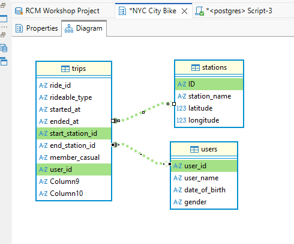

# 🚲 NYC Citi Bike: SQL Data Analysis

## 📌 Project Overview
This project analyzes a sample dataset from the NYC Citi Bike system. The goal of this analysis is to understand rider behavior, station popularity, and system logistics using PostgreSQL.

**Key Skills Demonstrated:** Data Cleaning, Complex Relational Joins, Aggregations, Common Table Expressions (CTEs), and Window Functions.

### 🗄️ Database Architecture
The relational database consists of three tables. *(Note: Data integrity was ensured by casting mismatched foreign keys to integers during joins).*

 

---

## 🔍 Featured Analysis & Insights

Here are a few standout queries from the full 18-question analysis. The complete SQL script containing all data exploration, cleaning, and aggregation queries can be found in the [`citi_bike_full_analysis.sql`](citi_bike_full_analysis.sql) file.

### 1. Mapping the Full Journey (Multi-Table Joins)
**Objective:** Combine all three tables to see exactly who rode the bike, where their trip started, and where it ended.

**Thought Process:** 
I joined the `stations` table twice—once for the start location and once for the end location—using aliases (`ss` and `es`). I strategically used a `LEFT JOIN` for both to ensure we didn't drop records of bikes that experienced dock errors or were lost.

```sql
SELECT 
    u.user_name,
    ss.station_name AS starting_point,
    es.station_name AS ending_point
FROM trips t 
JOIN users u ON CAST(t.user_id AS INTEGER) = CAST(u.user_id AS INTEGER) 
LEFT JOIN stations ss ON t.start_station_id = ss."ID"
LEFT JOIN stations es ON t.end_station_id = es."ID" 
LIMIT 20;
```

### 2. Demographic Riding Habits (Query Optimization)
**Objective:** Calculate the total number of rides taken by "senior" riders (users older than 60), grouped by individual.

**Optimization Strategy:** 
Instead of joining the entire `trips` table to all users and filtering at the very end, I created a Common Table Expression (CTE). I placed the `WHERE age > 60` filter *inside* the CTE to filter out non-seniors early, drastically reducing the data payload before the expensive `JOIN` operation occurs.

```sql
WITH RidersAge AS (
    SELECT 
        user_id,
        user_name,
        EXTRACT(YEAR FROM AGE(CURRENT_DATE, CAST(date_of_birth AS DATE))) AS age
    FROM users
    WHERE EXTRACT(YEAR FROM AGE(CURRENT_DATE, CAST(date_of_birth AS DATE))) > 60
)
SELECT 
    r.user_name,
    COUNT(t.ride_id) AS total_rides
FROM trips t
JOIN RidersAge r ON t.user_id = r.user_id
GROUP BY r.user_name
ORDER BY total_rides DESC;
```

### 3. User Retention Tracking (Window Functions)
**Objective:** Calculate how many minutes passed between a user's previous ride and their current ride.

**Thought Process:** 
I used the `LAG()` window function to look back at the previous row, partitioned by `user_id` so the history didn't bleed between different users. I wrapped this in a CTE to perform date-math on the result, using `EXTRACT(EPOCH)` to convert the interval into readable minutes.

```sql
WITH PreviousRide AS (
    SELECT 
        user_id,
        ride_id,
        started_at,
        LAG(started_at) OVER(PARTITION BY user_id ORDER BY started_at) AS previous_ride_start_time
    FROM trips
)
SELECT
    user_id,
    ride_id,
    previous_ride_start_time,
    ROUND(EXTRACT(EPOCH FROM (CAST(started_at AS TIMESTAMP) - CAST(previous_ride_start_time AS TIMESTAMP)))/60, 2) AS minute_since_last_ride
FROM PreviousRide
WHERE previous_ride_start_time IS NOT NULL
ORDER BY user_id, started_at
LIMIT 10;
```

---

## 🚀 Conclusion
This analysis successfully mapped rider journeys, identified key demographic behaviors, and tracked user retention using advanced SQL techniques.
